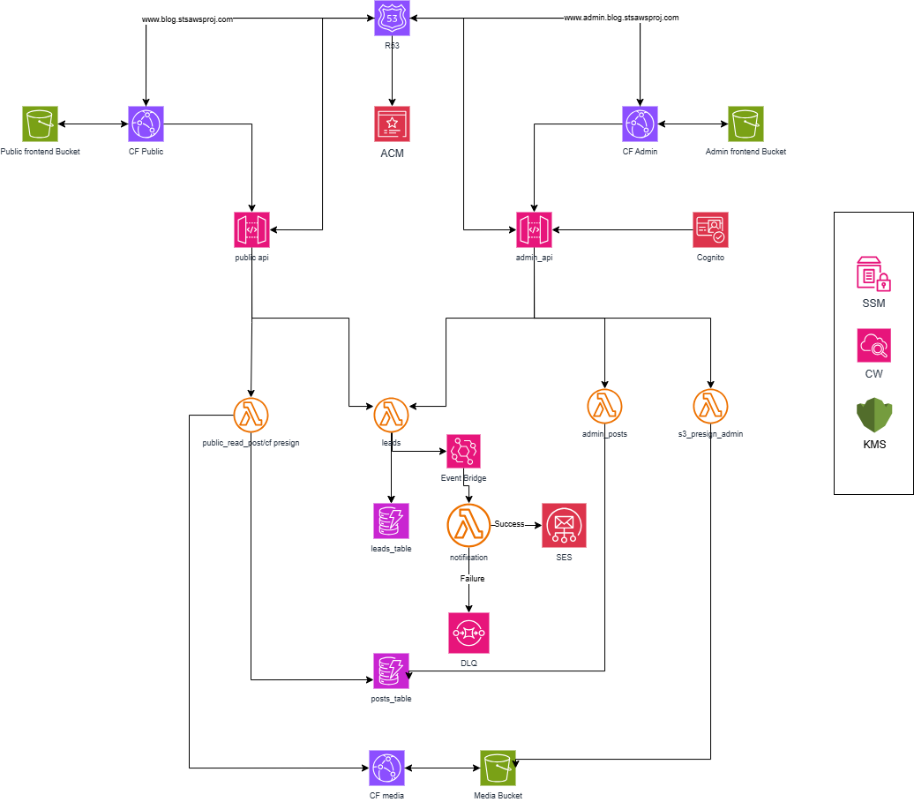

# Serverless Blog Platform (Public Blog + Admin CMS)

A production-style serverless blog platform with a public-facing site and a fully isolated admin CMS.

This system is designed to solve a real problem: serve public content safely at scale while giving admins full control, without ever exposing privileged access.

Two frontends. Two APIs. Clear security boundaries. Event-driven by default.

---

## 🎯 What problem this solves

Most blog demos blur everything together.

This one doesn’t.

* Public users can **only read content** and submit leads
* Admin users **authenticate and manage content** securely
* Media uploads stay private
* Async work never blocks user requests

What this really means is you can grow traffic, features, and teams without redesigning the system later.

---

## 🧠 What this project demonstrates

Here’s the thing. Anyone can deploy Lambda.

This project shows how to:

* Design **separate public and admin APIs**
* Enforce **strict IAM boundaries** per role
* Use **Cognito correctly**, not bolted on
* Build **event-driven workflows** with EventBridge
* Handle **secure media uploads** with presigned URLs
* Manage a full platform using **Terraform only**

This is how production serverless systems are actually built.

---

## 🏗 Architecture Overview

### Public side

* Public frontend hosted on **S3 + CloudFront**
* Public API Gateway (no authentication)
* Public Lambdas can:

  * Fetch published posts
  * Submit leads

### Admin side

* Admin frontend hosted separately on **S3 + CloudFront**
* Admin API Gateway protected by **Cognito User Pool**
* Admin Lambdas handle:

  * Create, update, delete posts
  * Publish, unpublish, archive posts
  * Generate presigned URLs for media uploads

### Async & supporting services

* **EventBridge** for decoupled workflows
* **SES** for email notifications
* **DLQ** for failed async events
* **Cleanup Lambda** triggered on post deletion

---

## 🖼 Architecture Diagram

---

## 🔐 Authentication & Security Decisions

Security is intentional, not accidental.

* Two API Gateways to avoid mixed trust levels
* Cognito protects **only** the admin surface
* Separate CloudFront distributions for isolation
* Media bucket is fully private
* Presigned URLs avoid routing large files through Lambda
* IAM roles are scoped per Lambda and per action

No shared credentials. No wildcard permissions.

---

## 🔌 API Design

### Public API Gateway

Routes:

* `GET /posts`
* `GET /posts/{postId}`
* `POST /leads`

Capabilities:

* Read-only access to published posts
* Submit leads

Public Lambdas cannot mutate posts.

---

### Admin API Gateway (Cognito-protected)

Routes:

* `POST /admin/posts`
* `PUT /admin/posts/{postId}`
* `DELETE /admin/posts/{postId}`
* `POST /admin/posts/{postId}/publish`
* `POST /admin/posts/{postId}/unpublish`
* `POST /admin/posts/{postId}/archive`
* `GET /admin/leads`
* `POST /media/media_url`

Only authenticated admins can access these endpoints.

---

## 🧩 Lambda Responsibilities

Each Lambda does one job.

### Public Lambdas

* List posts
* Get post by ID
* Create lead

### Admin Lambdas

* Create post
* Update post
* Delete post
* Publish / unpublish / archive post
* Generate presigned media URLs

### Shared Lambda

* Leads handler

  * Public: write leads
  * Admin: read leads

### Async Lambdas

* Notifications (SES)
* Cleanup (post deletion)

No god functions. No role overlap.

---

## 🗃 DynamoDB Design

### Posts Table

Primary key:

* `postId` (PK)

Global Secondary Indexes:

* `statusIndex` – query by status
* `publishedAtIndex` – sort and query published posts

Used by both public reads and admin workflows.

---

### Leads Table

Primary key:

* `leadId` (PK)

Global Secondary Indexes:

* Used for admin-side filtering and reporting

Public writes. Admin reads.

---

## 🖼 Media Handling

* Media bucket is fully private
* No public access
* Admin requests a presigned URL
* Browser uploads directly to S3

This keeps uploads fast and secure.

---

## 🔄 Event-Driven Flows

### User visits the blog

1. CloudFront serves frontend
2. Frontend calls Public API
3. Lambda queries DynamoDB using GSIs

---

### Admin publishes a post

1. Admin authenticates via Cognito
2. Admin API updates post status
3. Post becomes visible to public readers

---

### User submits a lead

1. Lead stored in DynamoDB
2. EventBridge event emitted
3. Notifications Lambda sends email via SES
4. Failures go to DLQ

---

### Admin deletes a post

1. Post deleted synchronously
2. EventBridge triggers cleanup Lambda
3. Related resources removed asynchronously

---

## 🌍 DNS, TLS & Routing

* Route 53 for DNS
* ACM for TLS certificates
* Alias records for:

  * Public frontend
  * Admin frontend
  * Public API
  * Admin API
  * Media access

HTTPS everywhere.

---

## 🔐 Configuration & Secrets

* SSM Parameter Store for frontend config
* KMS for encryption
* No secrets in code or Terraform

---

## 🚀 Infrastructure as Code

Everything is built using **Terraform**.

This includes:

* API Gateways
* Lambda functions
* IAM roles and policies
* DynamoDB tables and GSIs
* EventBridge rules
* CloudFront distributions
* Route 53 records
* ACM certificates

One command builds the platform.

---

## 📈 Observability

* CloudWatch Logs per Lambda
* API Gateway metrics
* DLQs for async failures

You can see what broke and why.

---

## 👤 Author

**Shaun**
Cloud / AWS Engineer

---

If you’re reviewing this, the Terraform code shows every decision clearly.
