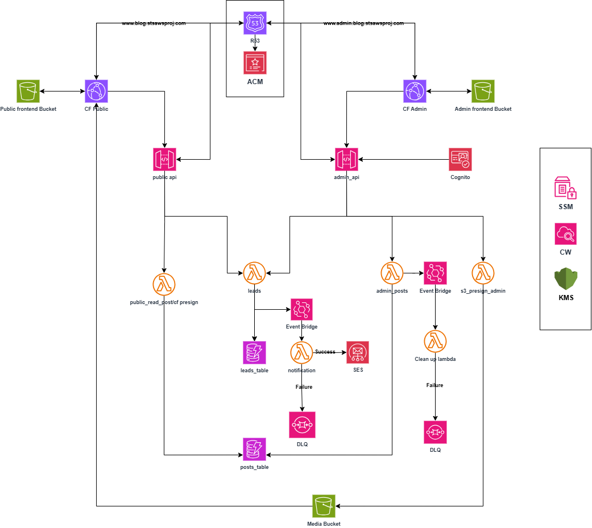

# Serverless Blog Platform — Public Blog + Admin CMS


A production-grade serverless blog platform on AWS with a public-facing blog and a fully isolated admin CMS. Two frontends, two APIs, clear security boundaries, event-driven by default, and fully managed through Terraform.

---

## Table of Contents

- [Problem Statement](#-problem-statement)
- [What This Project Demonstrates](#-what-this-project-demonstrates)
- [Architecture Overview](#-architecture-overview)
- [Architecture Diagram](#-architecture-diagram)
- [Project Structure](#-project-structure)
- [AWS Services Used](#-aws-services-used)
- [Infrastructure as Code (Terraform)](#-infrastructure-as-code-terraform)
- [Compute — Lambda Functions](#-compute--lambda-functions)
- [API Design — API Gateway](#-api-design--api-gateway)
- [Database Design — DynamoDB](#-database-design--dynamodb)
- [Storage — S3](#-storage--s3)
- [Content Delivery — CloudFront](#-content-delivery--cloudfront)
- [Authentication & Authorization — Cognito + IAM](#-authentication--authorization--cognito--iam)
- [Event-Driven Architecture — EventBridge](#-event-driven-architecture--eventbridge)
- [Email Notifications — SES](#-email-notifications--ses)
- [Media Handling — Presigned URLs](#-media-handling--presigned-urls)
- [CI/CD Pipelines — CodePipeline + CodeBuild + CodeDeploy](#-cicd-pipelines--codepipeline--codebuild--codedeploy)
- [Observability & Monitoring](#-observability--monitoring)
- [Security Deep Dive](#-security-deep-dive)
- [Frontend Applications](#-frontend-applications)
- [Configuration Management — SSM Parameter Store](#-configuration-management--ssm-parameter-store)
- [Event-Driven Flows (End-to-End)](#-event-driven-flows-end-to-end)
- [Failure Handling & Resilience](#-failure-handling--resilience)
- [Best Practices Applied](#-best-practices-applied)
- [Potential Improvements](#-potential-improvements)
- [Author](#-author)

---

## Problem Statement

Most serverless blog demos blur everything together — admin and public share the same API, media buckets are publicly accessible, and security is an afterthought.

This project solves that by design:

- Public users can **only read published content** and submit leads — nothing else
- Admin users **authenticate through Cognito** and manage content through a separate, isolated API
- Media uploads stay **fully private** — no public bucket access, ever
- Async work (emails, cleanup) **never blocks user requests**
- Every AWS resource is scoped with **least-privilege IAM policies**

The result is a system that can grow in traffic, features, and team size without redesigning the security model later.

---

## What This Project Demonstrates

- Designing **separate public and admin APIs** with different trust levels
- Enforcing **strict IAM boundaries** — each Lambda gets only the permissions it needs
- Using **Amazon Cognito** as a native API Gateway authorizer, not bolted on
- Building **event-driven workflows** with EventBridge, DLQs, and retry policies
- Handling **secure media uploads** with presigned URLs and content-type validation
- Deploying **canary releases** with CodeDeploy traffic shifting and automatic rollback
- Implementing **full observability** — structured logs, X-Ray traces, CloudWatch alarms, and a unified dashboard
- Managing the entire platform using **Terraform only** — no ClickOps, no CloudFormation

---

## Architecture Overview

The platform is split into two clearly separated surfaces:

### Public Side

```
User Browser
    │
    ▼
CloudFront (Public Distribution)
    │
    ├── /* ──────────► S3 (Public Frontend Bucket) ──► React SPA
    ├── /api/* ──────► API Gateway (Public) ──► Lambda ──► DynamoDB
    └── /media/* ────► S3 (Media Bucket) ──► Images/Videos via CDN
```

- Public frontend hosted on **S3 + CloudFront** (React + Vite SPA)
- Public API Gateway — **no authentication required**
- Public Lambdas can only:
  - Fetch published posts (read-only DynamoDB queries via GSI)
  - Submit leads (write to leads table + emit EventBridge event)

### Admin Side

```
Admin Browser
    │
    ▼
CloudFront (Admin Distribution)
    │
    ├── /* ──────────► S3 (Admin Frontend Bucket) ──► React SPA
    └── /media/* ────► S3 (Media Bucket) ──► Read-only media access

    │
    ▼
API Gateway (Admin) ──► Cognito User Pool Authorizer
    │
    ▼
Lambda Functions ──► DynamoDB / S3 / EventBridge
```

- Admin frontend hosted separately on **S3 + CloudFront**
- Admin API Gateway protected by **Cognito User Pool Authorizer**
- Admin Lambdas handle:
  - Full CRUD on posts (create, update, delete)
  - Lifecycle operations (publish, unpublish, archive, unarchive)
  - Generate presigned URLs for secure media uploads
  - Read leads submitted by public users

### Async & Supporting Services

```
EventBridge (Custom Event Bus)
    │
    ├── LeadCreated ──► Notifications Lambda ──► SES Email
    │                          │
    │                          └── On failure ──► SQS DLQ
    │
    └── PostDeleted ──► Cleanup Lambda ──► S3 Delete Media
                               │
                               └── On failure ──► SQS DLQ
```

- **Amazon EventBridge** for decoupled, event-driven workflows
- **Amazon SES** for transactional email notifications
- **SQS Dead Letter Queues** for capturing failed async events
- **Cleanup Lambda** triggered asynchronously on post deletion

---

## Architecture Diagram



---

## Project Structure

```
serverless/
│
├── admin-frontend/              # React + Vite admin CMS (TypeScript)
│   ├── src/                     # Application source code
│   ├── package.json             # Dependencies (React 19, TanStack Query, Amplify, TipTap)
│   ├── vite.config.ts           # Vite build configuration
│   └── tsconfig.json            # TypeScript configuration
│
├── public-frontend/             # React + Vite public blog (TypeScript)
│   ├── src/                     # Application source code
│   ├── package.json             # Dependencies (React 19, TanStack Query, Axios)
│   └── vite.config.ts           # Vite build configuration
│
├── backend/                     # Lambda function source code
│   ├── admin_blog_post/         # Admin CRUD operations (index.js)
│   ├── public_posts_lambda/     # Public read-only post access (index.js)
│   ├── leads_lambda/            # Lead creation + admin read (index.js)
│   ├── presign_lambda/          # Presigned URL generation (index.js)
│   ├── notifications_lambda/    # SES email handler (index.js)
│   ├── cleanup_lambda/          # Post deletion cleanup (index.js)
│   └── blog_lambda_layer/       # Shared Lambda Layer (AWS SDK, X-Ray SDK)
│
├── infrastructure/              # Terraform IaC (all AWS resources)
│   ├── main.tf                  # Provider config + Terraform settings
│   ├── variables.tf             # Global variables
│   ├── lambda.tf                # Lambda functions, layers, aliases, log groups
│   ├── api_gateway_admin.tf     # Admin API Gateway + Cognito authorizer
│   ├── api_gateway_public.tf    # Public API Gateway
│   ├── dynamodb.tf              # DynamoDB tables + GSIs
│   ├── s3.tf                    # S3 buckets (media, admin frontend, public frontend)
│   ├── cloudfront.tf            # CloudFront distributions (public + admin)
│   ├── cognito.tf               # Cognito User Pool + App Client
│   ├── eventbridge.tf           # Event bus, rules, targets, DLQs
│   ├── iam.tf                   # All IAM roles + policies (16 custom policies)
│   ├── ses.tf                   # SES email identity
│   ├── ssm.tf                   # SSM Parameter Store entries
│   ├── ci_cd_backend.tf         # Backend CI/CD pipeline (CodePipeline + CodeDeploy)
│   ├── ci_cd_admin.tf           # Admin frontend CI/CD pipeline
│   ├── ci_cd_public.tf          # Public frontend CI/CD pipeline
│   └── cloudwatch_dashboard.tf  # CloudWatch dashboard + alarms
│
├── buildspec.backend.yml        # CodeBuild spec for Lambda deployment
├── buildspec.admin-frontend.yml # CodeBuild spec for admin frontend
├── buildspec.public-frontend.yml# CodeBuild spec for public frontend
└── readme.md                    # This file
```

---

## AWS Services Used

| Service | Purpose | Configuration |
|---------|---------|---------------|
| **AWS Lambda** | Compute for all backend logic | Node.js 18.x, X-Ray tracing, 6 functions + 1 shared layer |
| **Amazon API Gateway** | REST API endpoints | 2 separate gateways (public + admin), throttling, CloudWatch logging |
| **Amazon DynamoDB** | Primary data store | 2 tables, on-demand billing, GSIs, encryption, contributor insights |
| **Amazon S3** | Static hosting + media storage | 3 private buckets, versioning, lifecycle rules, CORS |
| **Amazon CloudFront** | CDN and content delivery | 2 distributions, TLS 1.2+, custom cache behaviors |
| **Amazon Cognito** | Admin authentication | User Pool with email-based auth, admin-create-only |
| **Amazon EventBridge** | Async event routing | Custom event bus, 2 rules, retry policies, DLQ targets |
| **Amazon SES** | Transactional emails | Verified identity for lead notifications |
| **Amazon SQS** | Dead letter queues | 3 DLQs for failed async operations |
| **AWS CodePipeline** | CI/CD orchestration | 3 pipelines (backend, admin frontend, public frontend), V2 type |
| **AWS CodeBuild** | Build + deploy | Amazon Linux 2, Node.js 20, git-based change detection |
| **AWS CodeDeploy** | Canary Lambda deployments | 10% traffic shift for 5 min, auto-rollback |
| **AWS X-Ray** | Distributed tracing | All Lambdas + API Gateways instrumented |
| **Amazon CloudWatch** | Logs, metrics, alarms, dashboards | Structured logging, custom metrics, unified dashboard |
| **AWS IAM** | Access control | 16 custom policies, per-Lambda scoping, least privilege |
| **AWS KMS** | Encryption | Pipeline artifact encryption |
| **AWS SSM Parameter Store** | Configuration management | 8 parameters for frontend build-time injection |
| **Amazon SNS** | Alarm notifications | Alarm topic with email subscription |

---

## Infrastructure as Code (Terraform)

The entire platform is defined in Terraform (~15 `.tf` files). No manual AWS Console changes, no CloudFormation, no CDK.

**Terraform Configuration:**

| Setting | Value |
|---------|-------|
| Terraform version | >= 1.14 |
| AWS Provider | ~> 5.0 |
| Region | `eu-west-1` (Ireland) |
| Resource prefix | `sblg-` (serverless blog) |
| State management | Terraform state (configurable backend) |

**What Terraform manages:**
- 6 Lambda functions + 1 shared layer + aliases (`live` and `beta`)
- 2 API Gateways with stages, deployments, and method configurations
- 2 DynamoDB tables with GSIs and encryption
- 3 S3 buckets with lifecycle policies and versioning
- 2 CloudFront distributions with multiple origin behaviors
- 1 Cognito User Pool + App Client
- 1 EventBridge bus with 2 rules and DLQ targets
- 3 SQS dead letter queues
- 16 IAM policies with resource-level scoping
- 3 CI/CD pipelines (CodePipeline + CodeBuild + CodeDeploy)
- 8 SSM parameters for build-time configuration
- CloudWatch log groups, alarms, and a unified dashboard
- SNS topic for alarm notifications

**Naming Convention:**

All resources follow the pattern `{prefix}-{service}-{function}`:
```
sblg-posts              (DynamoDB table)
sblg-media-bucket       (S3 bucket)
sblg-cicd-backend       (CodePipeline)
sblg-cw-alarms          (SNS topic)
sblg-admin-blog-posts   (Lambda function)
```

---

## Compute — Lambda Functions

### Overview

The platform uses **6 Lambda functions** and **1 shared Lambda Layer**. Each function has a single responsibility and its own scoped IAM role.

| Function | Trigger | Purpose | AWS Services Accessed |
|----------|---------|---------|----------------------|
| `admin_blog_posts` | API Gateway (Admin) | Full CRUD + lifecycle on posts | DynamoDB (posts), EventBridge |
| `public_posts_lambda` | API Gateway (Public) | Read-only published posts | DynamoDB (posts, via GSI) |
| `leads_lambda` | API Gateway (Both) | Create leads (public) + read leads (admin) | DynamoDB (leads), EventBridge |
| `presign_lambda` | API Gateway (Admin) | Generate presigned upload URLs | S3 (media bucket) |
| `notifications_lambda` | EventBridge | Send email on new lead | SES |
| `cleanup_lambda` | EventBridge | Delete media on post deletion | S3 (media bucket) |

### Lambda Configuration

```
Runtime:            Node.js 18.x
Tracing:            AWS X-Ray (active)
Log retention:      7 days
Aliases:            live (production), beta (canary)
Layer:              Shared dependency layer (AWS SDK, X-Ray SDK)
```

### Shared Lambda Layer

All functions share a common Lambda Layer containing:

- `@aws-sdk/client-dynamodb` — DynamoDB operations
- `@aws-sdk/lib-dynamodb` — DynamoDB Document Client (simplified API)
- `@aws-sdk/client-eventbridge` — EventBridge PutEvents
- `@aws-sdk/client-ses` — SES SendEmail
- `@aws-sdk/client-s3` — S3 operations
- `@aws-sdk/s3-request-presigner` — Presigned URL generation
- `aws-xray-sdk` — X-Ray instrumentation and subsegment creation

### Lambda Code Patterns

Every Lambda function follows consistent patterns:

**Structured Logging:**
```javascript
const log = (level, message, extra = {}) => {
    console.log(JSON.stringify({
        level,
        message,
        timestamp: new Date().toISOString(),
        correlationId,
        ...extra
    }));
};
```

**X-Ray Tracing with Custom Subsegments:**
```javascript
const AWSXRay = require('aws-xray-sdk');
const ddbClient = AWSXRay.captureAWSv3Client(new DynamoDBClient({}));

// Named subsegments for each operation
const subsegment = segment.addNewSubsegment('DynamoDB-GetPost');
subsegment.addAnnotation('postId', postId);
subsegment.addAnnotation('coldStart', isColdStart);
```

**Cold Start Detection:**
```javascript
let isColdStart = true;
exports.handler = async (event) => {
    // Track cold starts for performance monitoring
    if (isColdStart) {
        log('INFO', 'Cold start detected');
        isColdStart = false;
    }
};
```

**Error Classification:**
```javascript
// Maps DynamoDB exceptions to proper HTTP status codes
if (error.name === 'ConditionalCheckFailedException') return 409;
if (error.name === 'ResourceNotFoundException') return 404;
if (error.name === 'ValidationException') return 400;
```

---

## API Design — API Gateway

### Why Two Separate API Gateways?

A single API Gateway with mixed public and private routes creates a larger attack surface and complicates IAM policies. By splitting into two gateways:

1. **Public API** — Zero authentication overhead. No Cognito authorizer attached. Only read operations exposed
2. **Admin API** — Every request validated against Cognito. Mutation operations only available here

This means a misconfiguration on one gateway cannot accidentally expose the other.

### Public API Gateway

| Method | Route | Lambda | Purpose |
|--------|-------|--------|---------|
| `GET` | `/posts` | `public_posts_lambda` | List published posts |
| `GET` | `/posts/{postId}` | `public_posts_lambda` | Get single post |
| `POST` | `/leads` | `leads_lambda` | Submit a lead |

**Configuration:**
- No authentication or authorization
- CloudWatch logging at ERROR level
- X-Ray tracing enabled
- Throttling: 50 requests/second, 100 burst

### Admin API Gateway (Cognito-Protected)

| Method | Route | Lambda | Purpose |
|--------|-------|--------|---------|
| `POST` | `/admin/posts` | `admin_blog_posts` | Create post |
| `PUT` | `/admin/posts/{id}` | `admin_blog_posts` | Update post |
| `DELETE` | `/admin/posts/{id}` | `admin_blog_posts` | Delete post |
| `POST` | `/admin/posts/{id}/publish` | `admin_blog_posts` | Publish post |
| `POST` | `/admin/posts/{id}/unpublish` | `admin_blog_posts` | Unpublish post |
| `POST` | `/admin/posts/{id}/archive` | `admin_blog_posts` | Archive post |
| `POST` | `/admin/posts/{id}/unarchive` | `admin_blog_posts` | Unarchive post |
| `GET` | `/admin/leads` | `leads_lambda` | List leads |
| `POST` | `/admin/media/upload_url` | `presign_lambda` | Get presigned upload URL |

**Configuration:**
- Cognito User Pool authorizer on all routes
- CloudWatch logging at ERROR level
- X-Ray tracing enabled
- Throttling: 50 requests/second, 100 burst

### API Gateway → CloudFront Integration

The public API is served through CloudFront with a path-based routing pattern:

```
CloudFront Distribution
    ├── /api/*   → API Gateway origin (CloudFront function strips /api/ prefix)
    ├── /media/* → S3 media bucket origin
    └── /*       → S3 frontend bucket (SPA fallback to index.html)
```

This means the frontend, API, and media are all served from the same domain — no CORS issues, single TLS certificate, unified caching layer.

---

## Database Design — DynamoDB

### Posts Table (`sblg-posts`)

| Setting | Value |
|---------|-------|
| Billing mode | On-demand (PAY_PER_REQUEST) |
| Primary key | `postID` (String) |
| Encryption | Server-side (AES-256) |
| Contributor Insights | Enabled |

**Global Secondary Indexes:**

| Index Name | Partition Key | Sort Key | Purpose |
|------------|---------------|----------|---------|
| `authorIDIndex` | `authorID` | `createdAt` | Query posts by author, sorted by creation date |
| `publishedAtIndex` | `status` | `publishedAt` | Query posts by status (PUBLISHED), sorted by publish date |

**Why these GSIs matter:**
- `publishedAtIndex` is used by the **public Lambda** to efficiently query only published posts in chronological order — no table scans required
- `authorIDIndex` supports admin filtering by author

**Access patterns:**

| Operation | Access Pattern | Used By |
|-----------|---------------|---------|
| Create post | PutItem | Admin Lambda |
| Get post | GetItem (by postID) | Admin + Public Lambda |
| List published posts | Query on publishedAtIndex (status=PUBLISHED) | Public Lambda |
| List posts by author | Query on authorIDIndex | Admin Lambda |
| Update post | UpdateItem | Admin Lambda |
| Delete post | DeleteItem | Admin Lambda |

### Leads Table (`sblg-leads`)

| Setting | Value |
|---------|-------|
| Billing mode | On-demand (PAY_PER_REQUEST) |
| Primary key | `leadID` (String) |
| Encryption | Server-side (AES-256) |
| Contributor Insights | Enabled |

**Access patterns:**

| Operation | Access Pattern | Used By |
|-----------|---------------|---------|
| Submit lead | PutItem | Leads Lambda (public) |
| List leads | Scan / Query | Leads Lambda (admin) |
| Get lead | GetItem (by leadID) | Leads Lambda (admin) |

### DynamoDB Best Practices Applied

- **On-demand billing** — no capacity planning, scales automatically with traffic
- **Server-side encryption** — data encrypted at rest using AWS managed keys
- **Contributor Insights** — identify most frequently accessed items and detect traffic anomalies
- **GSI design** — access patterns drive index design, not the other way around
- **No table scans on public path** — all public reads use GSI queries for predictable performance

---

## Storage — S3

### Three Fully Private Buckets

| Bucket | Purpose | Public Access |
|--------|---------|---------------|
| `sblg-media-bucket` | Blog post media (images, videos, PDFs) | Blocked |
| `sblg-admin-frontend-bucket` | Admin SPA static files | Blocked |
| `sblg-public-frontend-bucket` | Public SPA static files | Blocked |

All buckets have **public access fully blocked** — no ACLs, no bucket policies allowing public access. Content is served exclusively through CloudFront using Origin Access Control (OAC).

### Media Bucket Configuration

```
Versioning:           Enabled
CORS:                 Enabled (for browser-based uploads)
Lifecycle rules:
  - Current objects → STANDARD_IA after 30 days
  - Non-current versions expire after 365 days
Server-side encryption: Enabled
```

**Why versioning on the media bucket?**
- Protects against accidental overwrites
- Enables recovery of deleted media
- Non-current versions auto-expire after 365 days to control costs

### Frontend Bucket Configuration

```
Versioning:           Enabled
Lifecycle rules:
  - Non-current versions cleaned up automatically
Server-side encryption: Enabled
```

### S3 Security

- No bucket has any public access
- CloudFront accesses S3 through **Origin Access Control (OAC)** — the modern replacement for Origin Access Identity (OAI)
- Media uploads happen exclusively through **presigned URLs** — the browser uploads directly to S3, bypassing Lambda entirely
- Content-type validation happens at presigned URL generation time, not at upload time

---

## Content Delivery — CloudFront

### Two Separate Distributions

Matching the security boundary pattern, there are two CloudFront distributions:

### Public Distribution

| Behavior | Origin | Caching | Notes |
|----------|--------|---------|-------|
| `/*` (default) | Public frontend S3 | Enabled | SPA fallback: all 403/404 → `index.html` (200) |
| `/api/*` | Public API Gateway | Disabled | CloudFront function rewrites path (strips `/api/`) |
| `/media/*` | Media S3 bucket | Disabled | Direct media serving via CDN |

### Admin Distribution

| Behavior | Origin | Caching | Notes |
|----------|--------|---------|-------|
| `/*` (default) | Admin frontend S3 | Enabled | SPA fallback: all 403/404 → `index.html` (200) |
| `/media/*` | Media S3 bucket | Disabled | Read-only media access for admin preview |

### CloudFront Configuration

```
TLS:                  TLSv1.2 minimum
HTTP → HTTPS:         Redirect all
Price class:          All edge locations
Viewer protocol:      HTTPS only
Origin protocol:      HTTPS only
```

### Why Separate Distributions?

- **Security isolation** — admin and public content served from different CloudFront distributions means different access policies, different logging, different WAF rules if added
- **Independent invalidation** — deploying the admin frontend doesn't invalidate the public cache and vice versa
- **Independent monitoring** — CloudWatch metrics per distribution show public vs. admin traffic patterns separately

---

## Authentication & Authorization — Cognito + IAM

### Amazon Cognito Configuration

| Setting | Value |
|---------|-------|
| Username attribute | Email |
| Auto-verify | Email |
| Self-registration | **Disabled** (admin-create-only) |
| Password policy | 8+ chars, uppercase, lowercase, numbers, symbols |
| Auth flows | USER_PASSWORD_AUTH, REFRESH_TOKEN_AUTH, USER_SRP_AUTH |
| App client secret | None (browser-safe) |

**Why admin-create-only?**
- This is a CMS, not a social platform — only authorized admins should have accounts
- Prevents unauthorized sign-ups
- User provisioning is an explicit administrative action

### How Authentication Works

```
1. Admin opens CMS frontend
2. AWS Amplify (in React) handles Cognito login flow
3. User authenticates → receives JWT tokens
4. Frontend sends JWT in Authorization header
5. API Gateway validates JWT against Cognito User Pool
6. If valid → request reaches Lambda
7. If invalid → 401 Unauthorized (never reaches Lambda)
```

### IAM — 16 Custom Policies (Least Privilege)

Every Lambda function has its own IAM role with narrowly scoped policies. No shared roles, no wildcard permissions.

**Admin Blog Posts Lambda:**
| Policy | Permissions | Resource |
|--------|-------------|----------|
| `admin-lambda-dynamodb-posts-policy` | PutItem, GetItem, UpdateItem, DeleteItem, Query, Scan | Posts table + GSIs |
| `admin-lambda-event-policy` | PutEvents | Blog events bus |
| `admin-lambda-xray-policy` | PutTraceSegments, PutTelemetryRecords | `*` (X-Ray requires it) |

**Public Posts Lambda:**
| Policy | Permissions | Resource |
|--------|-------------|----------|
| `public-lambda-dynamodb-posts-policy` | Query only | Posts table + publishedAtIndex GSI |

**Leads Lambda:**
| Policy | Permissions | Resource |
|--------|-------------|----------|
| `leads-lambda-dynamodb-leads-policy` | PutItem, Query, GetItem, Scan | Leads table |
| `leads-lambda-event-policy` | PutEvents | Blog events bus |

**Presign Lambda:**
| Policy | Permissions | Resource |
|--------|-------------|----------|
| `presign-lambda-policy` | PutObject | Media bucket (`sblg-media-bucket/*`) |

**Notifications Lambda:**
| Policy | Permissions | Resource |
|--------|-------------|----------|
| `notifications-lambda-ses-policy` | SendEmail | SES identity |
| `notifications-lambda-dlq-policy` | SendMessage | Notifications DLQ |

**Cleanup Lambda:**
| Policy | Permissions | Resource |
|--------|-------------|----------|
| `cleanup-lambda-s3-permission` | DeleteObject | Media bucket |
| `cleanup-lambda-dlq-policy` | SendMessage | Cleanup DLQ |

**CloudFront Origin Access:**
| Policy | Permissions | Resource |
|--------|-------------|----------|
| `cloudfront-public-bucket-policy` | GetObject | Public frontend bucket |
| `cloudfront-admin-bucket-policy` | GetObject | Admin frontend bucket |
| `cloudfront-media-bucket-policy` | GetObject | Media bucket |

### Security Boundaries Visualized

```
┌─────────────────────────────────────────────────┐
│                   PUBLIC ZONE                     │
│                                                   │
│  CloudFront ──► S3 (frontend)                    │
│  CloudFront ──► API GW (no auth) ──► Lambda      │
│                                       │           │
│                           DynamoDB (Query only)   │
│                           EventBridge (PutEvents) │
└─────────────────────────────────────────────────┘

┌─────────────────────────────────────────────────┐
│                   ADMIN ZONE                      │
│                                                   │
│  CloudFront ──► S3 (frontend)                    │
│  API GW ──► Cognito ──► Lambda                   │
│                          │                        │
│              DynamoDB (full CRUD)                 │
│              S3 (presigned upload)                │
│              EventBridge (PutEvents)              │
└─────────────────────────────────────────────────┘

┌─────────────────────────────────────────────────┐
│                   ASYNC ZONE                      │
│                                                   │
│  EventBridge ──► Notifications Lambda ──► SES    │
│  EventBridge ──► Cleanup Lambda ──► S3 Delete    │
│                                                   │
│  Failures ──► SQS Dead Letter Queues             │
└─────────────────────────────────────────────────┘
```

---

## Event-Driven Architecture — EventBridge

### Custom Event Bus

A dedicated EventBridge bus (`blog-events-bus`) decouples synchronous API operations from async side effects.

### Event Rules

| Rule | Event Source | Detail Type | Target | Retry | DLQ |
|------|-------------|-------------|--------|-------|-----|
| `leads-created-rule` | `app.leads` | `LeadCreated` | Notifications Lambda | 10 attempts, 3600s max | `sblg-eventbridge-dlq` |
| `posts-deleted-rule` | `app.cleanup` | `PostDeleted` | Cleanup Lambda | 10 attempts, 3600s max | `sblg-eventbridge-dlq` |

### Why EventBridge?

- **Decoupling** — the leads Lambda doesn't need to know about email notifications. It emits an event and moves on
- **Retry policies** — failed targets are retried up to 10 times with exponential backoff
- **Dead letter queues** — events that exhaust retries land in SQS for investigation
- **Extensibility** — adding new event consumers (e.g., analytics, Slack notifications) requires zero changes to existing code

### Event Flow Example: Lead Submission

```
POST /leads
    │
    ▼
Leads Lambda
    ├── 1. Validate input (name, email, message)
    ├── 2. Write to DynamoDB (leads table)
    ├── 3. Emit event to EventBridge
    │       {
    │         source: "app.leads",
    │         detail-type: "LeadCreated",
    │         detail: { name, email, message }
    │       }
    └── 4. Return 201 to caller (async work decoupled)
              │
              ▼
         EventBridge Bus
              │
              ▼
    Notifications Lambda
         ├── Validate event detail
         ├── Send email via SES
         └── On failure → DLQ (sblg-notifications-dlq)
```

---

## Email Notifications — SES

| Setting | Value |
|---------|-------|
| Verified identity | `devsts14@gmail.com` |
| Trigger | EventBridge `LeadCreated` events |
| From | `devsts14@gmail.com` |
| To | `devsts14@gmail.com` (admin) |

When a new lead is submitted, the notifications Lambda sends a formatted email containing the lead's name, email, and message to the admin.

---

## Media Handling — Presigned URLs

### Upload Flow

```
1. Admin selects file in CMS frontend
2. Frontend calls POST /admin/media/upload_url
3. Presign Lambda validates content type against whitelist
4. Lambda generates presigned S3 PutObject URL (expires in 300s)
5. Frontend uploads file directly to S3 using presigned URL
6. File stored in media bucket, served via CloudFront
```

### Content-Type Whitelist

The presign Lambda enforces a strict content-type whitelist:

| Allowed Types |
|--------------|
| `image/jpeg` |
| `image/png` |
| `image/gif` |
| `image/webp` |
| `image/svg+xml` |
| `video/mp4` |
| `video/webm` |
| `application/pdf` |

**Blocked by design:** `text/html`, `application/javascript`, `text/css`, and anything else not in the whitelist. This prevents malicious content hosting (e.g., phishing pages or XSS payloads stored as HTML in S3).

### Why Presigned URLs?

- **Performance** — large files go directly to S3, not through API Gateway (10MB limit) or Lambda (6MB payload limit)
- **Cost** — no Lambda execution time or API Gateway data transfer for file uploads
- **Security** — URLs expire after 5 minutes, are single-use per object key, and enforce content type

---

## CI/CD Pipelines — CodePipeline + CodeBuild + CodeDeploy

### Three Independent Pipelines

Each pipeline is triggered independently based on file path changes, so deploying the admin frontend doesn't trigger a backend build.

### Backend Pipeline (`sblg-cicd-backend`)

**Trigger:** Changes to `backend/**` or `buildspec.backend.yml` on `dev` branch

```
GitHub (CodeStar Connection)
    │
    ▼
CodeBuild (Amazon Linux 2, Node.js 20)
    ├── 1. Git diff to detect which Lambdas changed
    ├── 2. If layer changed → rebuild all Lambdas
    ├── 3. Package only changed Lambdas (zip)
    ├── 4. Publish new Lambda versions
    └── 5. Trigger CodeDeploy canary deployment
              │
              ▼
         CodeDeploy (per Lambda)
              ├── Shift 10% traffic to new version
              ├── Monitor CloudWatch alarms for 5 minutes
              ├── If alarms trigger → automatic rollback
              └── If healthy → shift remaining 90% traffic
```

**Key feature: Change detection**
The buildspec uses `git diff` to identify which Lambda folders changed between commits. Only modified functions are repackaged and redeployed — unchanged Lambdas are skipped entirely. If the shared Lambda Layer changes, all functions are redeployed.

**CodeDeploy Canary Strategy:**

| Setting | Value |
|---------|-------|
| Deployment type | Blue/Green |
| Traffic shift | `Canary10Percent5Minutes` |
| Auto-rollback | On CloudWatch alarm trigger |
| Deployment groups | 6 (one per Lambda function) |

Each Lambda has its own CodeDeploy deployment group, so a failing deployment of `notifications_lambda` doesn't affect `admin_blog_posts`.

### Admin Frontend Pipeline (`sblg-cicd-admin`)

**Trigger:** Changes to `admin-frontend/**` or `buildspec.admin-frontend.yml` on `dev` branch

```
GitHub → CodeBuild
    ├── Fetch SSM parameters (API URLs, Cognito config)
    ├── npm install
    ├── npm run build (Vite + TypeScript)
    ├── aws s3 sync dist/ s3://admin-frontend-bucket
    └── aws cloudfront create-invalidation (clear cache)
```

### Public Frontend Pipeline (`sblg-cicd-public`)

**Trigger:** Changes to `public-frontend/**` or `buildspec.public-frontend.yml` on `dev` branch

Same pattern as admin frontend — build, sync to S3, invalidate CloudFront cache.

### Pipeline Configuration

| Setting | Value |
|---------|-------|
| Pipeline type | V2 (event-driven triggers) |
| Source | CodeStar Connection (GitHub) |
| Build environment | Amazon Linux 2, medium instance, 20GB |
| Artifact encryption | KMS |
| Artifact retention | 60 days |

---

## Observability & Monitoring

### Three Pillars of Observability

This project implements all three pillars:

### 1. Structured Logging (CloudWatch Logs)

Every Lambda emits structured JSON logs with consistent fields:

```json
{
    "level": "INFO",
    "message": "Post created successfully",
    "timestamp": "2025-01-15T10:30:00.000Z",
    "correlationId": "abc-123-def",
    "postId": "post-456",
    "coldStart": true
}
```

| Setting | Value |
|---------|-------|
| Log format | JSON (structured) |
| Retention | 7 days |
| Log groups | One per Lambda function |
| Key fields | level, message, timestamp, correlationId |
| Custom fields | Context-specific (postId, leadId, etc.) |

**Why 7-day retention?** Balances cost with debugging needs. For production, this could be extended or logs could be exported to S3 for long-term archival.

### 2. Distributed Tracing (AWS X-Ray)

X-Ray is enabled on every Lambda and both API Gateways, providing end-to-end request tracing.

**What's traced:**
- API Gateway → Lambda invocation
- Lambda → DynamoDB operations (individual subsegments)
- Lambda → EventBridge PutEvents
- Lambda → S3 operations
- Lambda → SES SendEmail

**Custom annotations on traces:**
- `correlationId` — links related operations across services
- `coldStart` — tracks Lambda cold start occurrences
- `postId`, `leadId` — resource identifiers for filtering
- Error messages and stack traces on failures

**X-Ray Service Map** provides a visual dependency graph showing:
- Which services call which other services
- Latency at each hop
- Error rates per service
- Throttling indicators

### 3. Metrics & Alarms (CloudWatch)

#### CloudWatch Alarms

All alarms publish to SNS topic `sblg-cw-alarms` → email notification.

**Lambda Alarms (per function):**
| Alarm | Condition | Period |
|-------|-----------|--------|
| Error rate | Errors > threshold | 5 min |
| Duration (p99) | Duration > threshold | 5 min |
| Throttles | Throttles > 0 | 1 min |

**API Gateway Alarms (per gateway):**
| Alarm | Condition | Period |
|-------|-----------|--------|
| 5xx error rate | 5xx count > threshold | 5 min |
| High latency (p99) | Latency > threshold | 5 min |

**DynamoDB Alarms (per table):**
| Alarm | Condition | Period |
|-------|-----------|--------|
| Read throttles | ReadThrottleEvents > 0 | 5 min |
| Write throttles | WriteThrottleEvents > 0 | 5 min |
| High consumed capacity | Consumed RCU/WCU > threshold | 5 min |

**CloudFront Alarms:**
| Alarm | Condition |
|-------|-----------|
| 5xx error rate | Origin 5xx errors > threshold |
| Origin latency | Origin latency > threshold |

**EventBridge Alarms:**
| Alarm | Condition |
|-------|-----------|
| Failed invocations | FailedInvocations > 0 per rule |

**DLQ Alarms:**
| Alarm | Condition |
|-------|-----------|
| Visible messages | ApproximateNumberOfMessagesVisible > 1 |

#### Custom Metrics

- **Lambda Error Log Metric** — CloudWatch Metric Filter matches "ERROR" pattern in Lambda logs → custom metric `Custom/AdminBlogPostsLambda/ErrorLogs`

### Unified CloudWatch Dashboard

A comprehensive dashboard (`cloudwatch_dashboard.tf`) provides a single-pane-of-glass view across the entire platform:

| Section | Widgets |
|---------|---------|
| **SLA/SLI Overview** | Alarm status grid, availability indicators |
| **Lambda** | Invocations, errors, duration, throttles, concurrent executions, log insights |
| **API Gateway** | Request count, latency (p50/p90/p99), 4xx/5xx rates |
| **DynamoDB** | Read/write consumed capacity, throttle events, system errors |
| **CloudFront** | Requests, bytes transferred, cache hit rate, error rates |
| **SQS (DLQs)** | Message counts across all 3 DLQs |
| **EventBridge** | Rule invocations, failed invocations, matched events |
| **CI/CD** | Pipeline execution counts, build durations, success/failure rates |

---

## Security Deep Dive

### Defense in Depth — Multiple Security Layers

```
Layer 1: Network
    └── HTTPS/TLS everywhere (CloudFront, API Gateway)
    └── TLS 1.2 minimum on CloudFront

Layer 2: Edge
    └── CloudFront as reverse proxy (origin servers not directly accessible)
    └── API Gateway throttling (50 req/s, 100 burst)

Layer 3: Authentication
    └── Cognito User Pool validates JWT on admin API
    └── Admin-create-only (no self-registration)
    └── Strong password policy

Layer 4: Authorization
    └── 16 granular IAM policies
    └── Per-Lambda role scoping
    └── No wildcard permissions
    └── Resource-level ARN restrictions

Layer 5: Data
    └── DynamoDB server-side encryption (AES-256)
    └── S3 server-side encryption
    └── KMS encryption for CI/CD artifacts
    └── No secrets in code or Terraform variables

Layer 6: Application
    └── Input validation in every Lambda
    └── Content-type whitelist for uploads
    └── Presigned URLs expire after 5 minutes
    └── Structured error handling (no stack trace leaks)
```

### Key Security Decisions

| Decision | Rationale |
|----------|-----------|
| Two API Gateways | Prevents mixed trust levels on a single gateway |
| Admin-create-only Cognito | CMS users are explicitly provisioned, not self-registered |
| No public S3 buckets | All content served through CloudFront OAC |
| Content-type whitelist | Prevents hosting of malicious files (HTML, JS) in media bucket |
| Per-Lambda IAM roles | Compromise of one function doesn't grant access to unrelated resources |
| No wildcard permissions | Every IAM action targets a specific resource ARN |
| Presigned URL expiry | 5-minute window limits exposure of upload URLs |
| DLQs for async failures | Failed events are captured, not silently dropped |

---

## Frontend Applications

### Admin Frontend (React + TypeScript + Vite)

A full-featured CMS for managing blog content.

**Tech Stack:**

| Library | Version | Purpose |
|---------|---------|---------|
| React | 19 | UI framework |
| TypeScript | — | Type safety |
| Vite | — | Build tool |
| React Router DOM | v7 | Client-side routing |
| TanStack React Query | v5 | Server state management + caching |
| React Hook Form + Zod | v7 | Form handling + schema validation |
| AWS Amplify | v6 | Cognito authentication integration |
| TipTap | v3 | Rich text editor for blog posts |
| Radix UI | — | Accessible UI primitives |
| Tailwind CSS | v4 | Utility-first styling |
| Zustand | — | Client state management |
| Axios | — | HTTP client |

**Build-time configuration** (injected from SSM Parameter Store via CodeBuild):
- `VITE_ADMIN_API_BASE_URL` — Admin API Gateway endpoint
- `VITE_PUBLIC_API_BASE_URL` — Public API Gateway endpoint
- `VITE_MEDIA_CDN_URL` — CloudFront media domain
- `VITE_COGNITO_USER_POOL_ID` — Cognito User Pool ID
- `VITE_COGNITO_CLIENT_ID` — Cognito App Client ID
- `VITE_AWS_REGION` — AWS region

### Public Frontend (React + TypeScript + Vite)

A lightweight, read-only blog viewer.

**Tech Stack:**

| Library | Version | Purpose |
|---------|---------|---------|
| React | 19 | UI framework |
| TypeScript | — | Type safety |
| Vite | — | Build tool |
| React Router DOM | v7 | Client-side routing |
| TanStack React Query | v5 | Server state management + caching |
| Axios | — | HTTP client |

**Build-time configuration:**
- `VITE_PUBLIC_API_BASE_URL` — Public API Gateway endpoint
- `VITE_MEDIA_CDN_URL` — CloudFront media domain

**Design choice:** The public frontend is intentionally lightweight — no authentication library, no rich text editor, no form framework. It only reads and displays content.

---

## Configuration Management — SSM Parameter Store

All runtime and build-time configuration is stored in AWS Systems Manager Parameter Store, not hardcoded in source code or Terraform.

| Parameter Path | Value | Used By |
|---------------|-------|---------|
| `/{prefix}/admin_frontend/admin_api_url` | Admin API endpoint | Admin frontend build |
| `/{prefix}/admin_frontend/public_api_url` | Public API endpoint | Admin frontend build |
| `/{prefix}/admin_frontend/cognito_user_pool_id` | Cognito User Pool ID | Admin frontend build |
| `/{prefix}/admin_frontend/cognito_client_id` | Cognito App Client ID | Admin frontend build |
| `/{prefix}/admin_frontend/media_cdn_url` | CloudFront media URL | Admin frontend build |
| `/{prefix}/media/cdn_url` | CloudFront media domain | Lambda functions |
| `/{prefix}/public_frontend/public_api_url` | Public API endpoint | Public frontend build |
| `/{prefix}/public_frontend/media_cdn_url` | CloudFront media URL | Public frontend build |

**Why SSM Parameter Store?**
- Terraform outputs resource URLs → stores in SSM
- CodeBuild reads SSM parameters → injects as Vite environment variables at build time
- No manual copy-pasting of URLs between services
- Configuration changes don't require code changes

---

## Event-Driven Flows (End-to-End)

### Flow 1: Public User Reads a Blog Post

```
1. Browser requests blog page
2. CloudFront serves React SPA from S3
3. React app calls GET /api/posts (CloudFront → API Gateway)
4. Public Lambda queries DynamoDB publishedAtIndex GSI
5. Returns only PUBLISHED posts, sorted by publishedAt
6. Images loaded from /media/* (CloudFront → S3 media bucket)
```

### Flow 2: Admin Creates and Publishes a Post

```
1. Admin logs in via Cognito (AWS Amplify handles flow)
2. Admin writes post in TipTap rich text editor
3. Media upload: POST /admin/media/upload_url → presigned URL → direct S3 upload
4. Save draft: POST /admin/posts → Lambda → DynamoDB PutItem
5. Publish: POST /admin/posts/{id}/publish → Lambda → DynamoDB UpdateItem
6. Post now appears on public blog (status=PUBLISHED in publishedAtIndex GSI)
```

### Flow 3: User Submits a Lead

```
1. User fills out contact form on public blog
2. POST /leads → Leads Lambda
3. Lambda validates input (name, email, message required)
4. Lambda writes to DynamoDB leads table
5. Lambda emits LeadCreated event to EventBridge
6. EventBridge routes to Notifications Lambda
7. Notifications Lambda sends email via SES
8. If email fails → retry up to 10 times → DLQ
```

### Flow 4: Admin Deletes a Post

```
1. Admin calls DELETE /admin/posts/{id}
2. Admin Lambda deletes post from DynamoDB (synchronous)
3. Lambda emits PostDeleted event to EventBridge (async)
4. EventBridge routes to Cleanup Lambda
5. Cleanup Lambda deletes associated media from S3
6. If cleanup fails → retry up to 10 times → DLQ
7. Admin gets immediate 200 response (doesn't wait for cleanup)
```

---

## Failure Handling & Resilience

### Dead Letter Queues (3 SQS Queues)

| DLQ | Captures Failures From |
|-----|----------------------|
| `sblg-notifications-dlq` | Notifications Lambda (email failures) |
| `sblg-cleanup-dlq` | Cleanup Lambda (S3 deletion failures) |
| `sblg-eventbridge-dlq` | EventBridge failed invocations |

All DLQs have CloudWatch alarms — when messages appear, the operations team is notified via SNS email.

### Retry Strategy

| Component | Retry Behavior |
|-----------|---------------|
| API Gateway → Lambda | Synchronous — no retries (error returned to client) |
| EventBridge → Lambda | 10 retries, 3600s maximum event age |
| CodeDeploy canary | Auto-rollback on CloudWatch alarm trigger |
| Lambda cold starts | Tracked via structured logs + X-Ray annotations |

### What Happens When Things Fail?

| Failure | Behavior |
|---------|----------|
| Lambda throws error | API Gateway returns 5xx → CloudWatch alarm fires |
| DynamoDB throttled | Lambda returns error → client retries → alarm fires |
| EventBridge target fails | Retried 10 times → DLQ → alarm on DLQ message count |
| SES email fails | Notification Lambda fails → EventBridge retries → DLQ |
| Canary deployment unhealthy | CodeDeploy auto-rolls back to previous version |
| CloudFront origin error | 5xx alarm fires → SNS notification |

---

## Best Practices Applied

### Architecture

- **Separation of concerns** — public and admin are completely isolated at every layer (CloudFront, API Gateway, Lambda, IAM)
- **Single-responsibility functions** — each Lambda does one job, has one IAM role, accesses one or two services
- **Event-driven design** — async work decoupled from synchronous API responses via EventBridge
- **Stateless compute** — Lambdas hold no state, enabling horizontal scaling

### Security

- **Least privilege IAM** — 16 granular policies, no wildcards, resource-level ARN scoping
- **Defense in depth** — TLS, Cognito, IAM, encryption at rest, input validation
- **No public S3 access** — everything served through CloudFront OAC
- **Content-type validation** — prevents malicious file hosting via presigned URLs
- **Admin-create-only auth** — no self-registration in Cognito

### Observability

- **Three pillars** — structured logs (CloudWatch), distributed traces (X-Ray), metrics + alarms (CloudWatch)
- **Correlation IDs** — trace a request across Lambda → DynamoDB → EventBridge → SES
- **Custom metrics** — error log patterns extracted as CloudWatch metrics
- **Unified dashboard** — single view across all services
- **DLQ monitoring** — alarms on message count to catch silent failures

### CI/CD

- **Canary deployments** — 10% traffic for 5 minutes, auto-rollback on alarm
- **Change detection** — only modified Lambdas are redeployed (git diff)
- **Path-based triggers** — frontend changes don't trigger backend builds
- **Artifact encryption** — KMS encryption on CodePipeline artifacts

### Cost Optimization

- **On-demand DynamoDB** — no over-provisioned capacity
- **7-day log retention** — keeps costs low while maintaining debuggability
- **S3 lifecycle rules** — media transitions to STANDARD_IA after 30 days
- **Lambda Layer** — shared dependencies reduce deployment package sizes
- **CloudFront caching** — reduces origin requests for static content

### Infrastructure as Code

- **100% Terraform** — every resource is codified, reviewable, and version-controlled
- **Consistent naming** — `sblg-` prefix on all resources
- **No hardcoded values** — variables and SSM parameters for configuration
- **Modular file organization** — one `.tf` file per service domain

---

## Potential Improvements

| Area | Improvement | Why |
|------|------------|-----|
| **Security** | Add AWS WAF rules to CloudFront distributions | Rate limiting, geo-blocking, SQL injection protection, bot mitigation |
| **Security** | Enable AWS Config rules for compliance monitoring | Detect configuration drift, enforce tagging policies |
| **Security** | Add VPC + VPC endpoints for Lambda functions | Network isolation for Lambda ↔ DynamoDB/S3 traffic |
| **Observability** | Export CloudWatch Logs to S3 via Kinesis Firehose | Long-term log archival beyond 7-day retention |
| **Observability** | Add CloudWatch Synthetics canaries | Proactive synthetic monitoring of API endpoints |
| **Observability** | Integrate with AWS Chatbot for Slack alarm notifications | Faster incident response than email |
| **Performance** | Add DynamoDB Accelerator (DAX) for read caching | Sub-millisecond reads for published posts |
| **Performance** | Enable CloudFront caching for API responses | Cache popular published posts at the edge |
| **Performance** | Add Lambda Provisioned Concurrency for critical functions | Eliminate cold starts on admin and public Lambdas |
| **Resilience** | Add DynamoDB point-in-time recovery (PITR) | 35-day continuous backup for disaster recovery |
| **Resilience** | Enable S3 cross-region replication for media bucket | Multi-region durability for uploaded media |
| **Resilience** | Add Circuit Breaker pattern with Step Functions | Graceful degradation for async workflows |
| **Cost** | Add DynamoDB auto-scaling (if switching to provisioned) | Right-size capacity for predictable traffic patterns |
| **Cost** | Add S3 Intelligent-Tiering for media bucket | Automatic cost optimization based on access patterns |
| **CI/CD** | Add integration tests in CodeBuild before deployment | Catch regressions before traffic shift |
| **CI/CD** | Add Terraform plan/apply pipeline | Automate infrastructure changes with PR-based reviews |
| **Auth** | Add MFA to Cognito User Pool | Stronger admin authentication |
| **Auth** | Add Cognito groups for role-based access control | Author vs. Editor vs. Admin permissions |
| **API** | Add API Gateway usage plans and API keys | Per-client throttling and usage tracking |
| **API** | Add request/response validation models in API Gateway | Schema validation before Lambda execution |
| **Frontend** | Add CloudFront Functions for security headers | CSP, HSTS, X-Frame-Options at the edge |
| **DNS** | Add Route 53 health checks with failover routing | Automatic DNS failover on regional failure |

---

## Author

**Shaun**
Cloud / AWS Engineer

---

*The Terraform code shows every decision clearly. Every resource, every IAM policy, every alarm — it's all in the infrastructure directory.*
